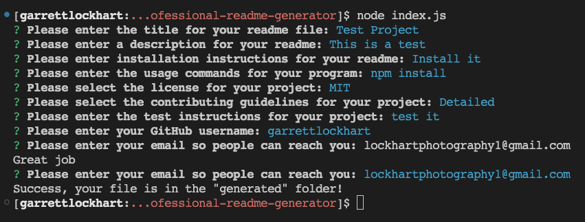

<!-- https://github.com/othneildrew/Best-README-Template -->

<div id="top"></div>

<!-- PROJECT LOGO -->
<br />
<div align="center">
  <a href="https://github.com/GarrettLockhart/professional-readme-generator">
    
  </a>

<h3 align="center">CLI README Generator</h3>

  <p align="center">
    A README generator using node.js, inquirer, CLI.
    <br />
    <br />
    <br />
    <a href="https://github.com/GarrettLockhart/weather-app/issues">Report Bug</a>
    ·
    <a href="https://github.com/GarrettLockhart/weather-app/issues">Request Feature</a>
  </p>
</div>
<br />
<br />
<br />

<!-- TABLE OF CONTENTS -->
<details>
  <summary>Table of Contents</summary>
  <ol>
    <li>
      <a href="#about-the-project">About The Project</a>
        <li><a href="#built-with">Built With</a></li>
    </li>
    <li><a href="#live-site">Live Site</a></li>
  </ol>
</details>
<br />

<!-- ABOUT THE PROJECT -->

## About The Project

This project was built using node.js and inquirer, it is run from the command line and will prompt you to answer questions using the command line to the fill out the data of the readme file and then create the file for you, using the node.js file system to handle writing the file. You can find the generated file in the "generated" folder. Please see the installation instructions for more information.

### Built With

- [node.js](https://nodejs.org/en/)
- [Inquirer](https://www.npmjs.com/package/inquirer)

<br />
<br />
<br />

## Installation instructions

Once you have the project on your computer you can open it in your command line and run

```
npm install
```

After that has finished downloading the node_modules folder you can go back to the command line and run

```
node index.js
```

Then answer the questions accordingly and your generated readme file will be output to the "generated folder".

<br />
<br />
<br />

<!-- CONTRIBUTING -->

## Contributing

Any contributions you make are **greatly appreciated**.

If you have a suggestion that would make this better, please fork the repo and create a pull request. You can also simply open an issue with the tag "enhancement".
Don't forget to give the project a star! Thanks again!

1. Fork the Project
2. Create your Feature Branch (`git checkout -b feature/AmazingFeature`)
3. Commit your Changes (`git commit -m 'Add some AmazingFeature'`)
4. Push to the Branch (`git push origin feature/AmazingFeature`)
5. Open a Pull Request

<!-- CONTACT -->

<br />
<br />

## Demo Screenshot



<p align="right">(<a href="#top">back to top</a>)</p>
